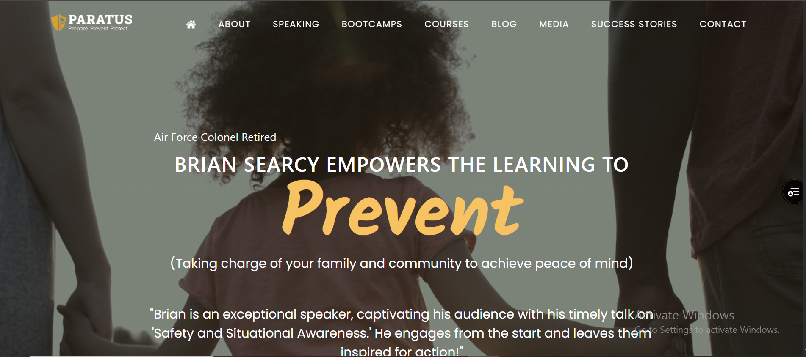
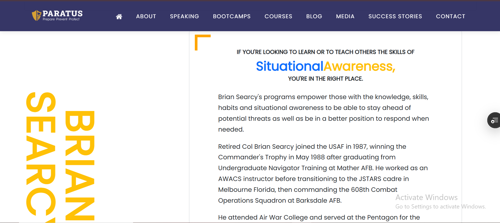
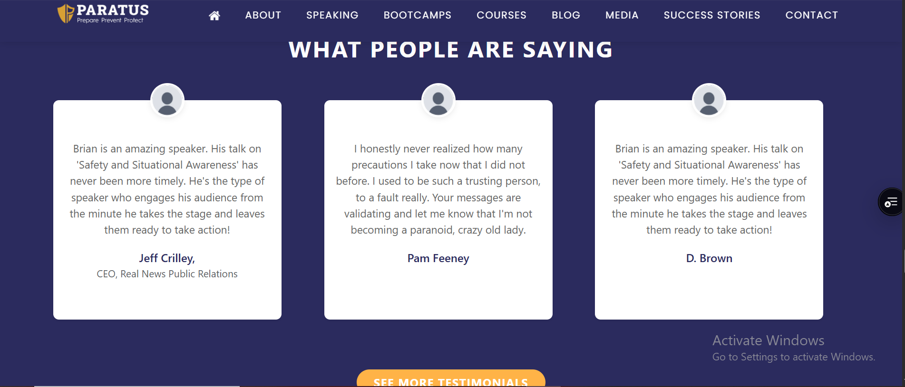

# 🌐 Prevent Safety App

A **responsive web application** built with **React.js** to provide safety tips and preventive measures.  

🚀 **[Live Demo](https://prevent-safety-app.vercel.app)**  

---

## ✅ Features  
✔ Responsive design using **React & Bootstrap 5**  
✔ Hero section with an engaging introduction  
✔ Safety Awareness section with educational content  
✔ Testimonials highlighting user feedback  
✔ Modern UI with images and easy navigation  

---

## 🛠 Tech Stack  
- **Frontend:** React.js, Bootstrap 5, JavaScript, HTML5, CSS3  
- **Deployment:** Vercel  

---

## 📷 Screenshots  
| Home | Awareness | Testimonials |
|------|-----------|-------------|
|  |  |  |

---

## ⚙ How to Run Locally  

```bash
# Clone the repository
git clone https://github.com/HumaylShoukat/prevent-safety-app.git

# Navigate to project folder
cd prevent-safety-app

# Install dependencies
npm install

# Start development server
npm start
